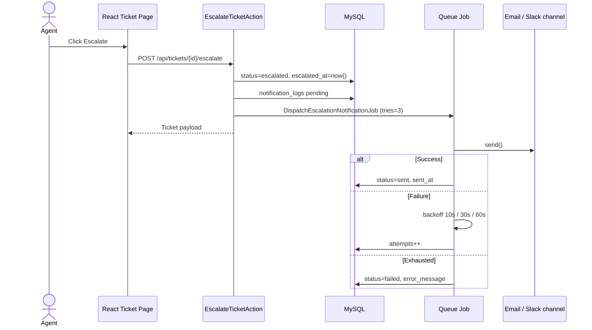

# Flojics — Ticket Escalation

Help Desk SaaS slice: escalate a ticket, record the escalation time, and notify through Email and Slack with automatic retries.

Escalate a ticket, persist `escalated_at`, and fan out Email + Slack with queued retries. Architecture notes live in `docs/`.

## Stack

| Area | Choice |
|---|---|
| API | Laravel 11, PHP 8.3, MySQL 8 |
| Frontend | React 19, Vite, TypeScript |
| UI | Tailwind CSS 4, shadcn |
| Data | TanStack Query, Axios, Zod, React Hook Form |
| Quality | oxlint, Prettier, Husky, commitlint, lint-staged, Pint, Pest, Larastan |
| CI | GitHub Actions (`frontend` + `backend` jobs) |

## Escalation flow



## Repository layout

```
backend/     Laravel 11 API
frontend/    React + Vite + TypeScript
docs/        Requirements, architecture, database, testing
```

## Prerequisites

- PHP 8.3+, Composer
- Bun 1.4+
- Docker (MySQL + phpMyAdmin) or a local MySQL 8

## Setup

### 1. Database

```bash
docker compose up -d
```

MySQL is on `127.0.0.1:3306` (`flojics` / `secret`). phpMyAdmin is on [http://localhost:8081](http://localhost:8081).

### 2. Backend

```bash
cd backend
cp .env.example .env
php artisan key:generate
composer install
php artisan migrate --seed
php artisan serve
```

Queue worker (required so Email/Slack retries actually run):

```bash
php artisan queue:work
```

### 3. Frontend

```bash
cd frontend
cp .env.example .env
bun install
bun run dev
```

Vite prints the local URL (usually [http://localhost:5173](http://localhost:5173)).

## Quality commands

Frontend:

```bash
cd frontend
bun run lint
bun run typecheck
bun run build
```

Backend:

```bash
cd backend
composer lint
composer analyse
composer test
```

Commits must follow [Conventional Commits](https://www.conventionalcommits.org/). Husky runs commitlint and lint-staged from the repo root.

## Docs

- [Requirement analysis](docs/REQUIREMENTS.md) — questions, assumptions, recommendations
- [Architecture](docs/ARCHITECTURE.md) — folders, channels, retry, how to add a channel
- [Database](docs/DATABASE.md) — tables, relations, indexes
- [Testing](docs/TESTING.md) — cases and self-testing notes
